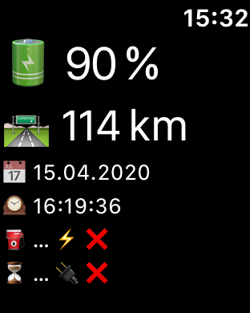
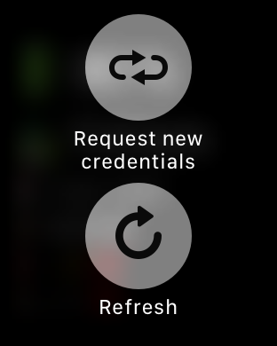
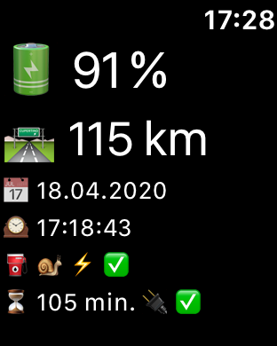

# ZOE Status

The *ZOE Status* app [(AppStore Link)](https://apps.apple.com/de/app/zoe-status/id1452074551)
is a replacement for Renault's official *My Renault* app on the iOS AppStore. 
However, it currently only covers a small part of its functionality:

- Battery state of charge (% and km)
- Charger state (e.g. speed)
- A/C preconditioning immediate and timed trigger, including result of last transmitted command

The goal is not really to eventually cover everything but to provide easier access to the most useful features in comparison to the official app.

It is based on the two APIs that were reverse engineered by

- Terence Eden: [Z.E. API analysis](https://github.com/edent/Renault-Zoe-API) [deprecated]
- James Muscat: [My Renault API analysis](https://muscatoxblog.blogspot.com/2019/07/delving-into-renaults-new-api.html), [Reference implementation in python](https://github.com/jamesremuscat/pyze),)

I am not sure if the former is still in use anywhere in the world. I am no longer able to maintain it, so support was dropped from ZOE Status in v1.1.x and later. 

As long as there is no official API documentation, this app can hardly ever have more features than the offical website or app. It only attempts to make them a little more usable. For example, the latest version of the offical Z.E. Services app was asking for the credentials on almost every launch, which was rather annoying. With ZoeStatus, you only have to enter them once. 
Also, **ZOE Status includes an iOS Widget and an AppleWatch counterpart**, whereas the official app lacks both. There is a Start A/C command shortcut if you long-press the App icon, and **Siri** can report the charge state of the car.

## Prerequisites:

- Renault "Zero Emission" vehicle, e.g. Renault ZOE
- Active [Renault ZE services](https://www.services.renault-ze.com) [deprecated] or  [My Renault](https://myr.renault.de) (country-specific) account.

## Compilation / Installation:

Use latest Xcode to open and finally compile and install "ZoeStatus.xcodeproj" on your iOS device (iOS 14.0 and above).
Use the watch application to transfer the companion app to your Apple Watch (watchOS 6.1 and avove).

## Usage:
At the first launch it should take you to the settings app, where you need to enter your Z.E. services / My Renault credentials. It also requires a so-called Kamereon key. This field is pre-filled with the one known to be working at the time of release. You may have to replace it occasionally with a newer one, which is easy to find on the internet.

[**Note that all screenshots are slightly outdated at the time of writing.**]

The credentials are only used to login to the service. Please check the source code files to verify that they are not transmitted anywhere else. This is why the source is published here.

The app's main user interface is rather primitive and currently all icon based because doing so saves me from providing a dozen translations:

 

The meaning of the symbols in order of appearance (left-to-right and top-down) on the app's main screen is as follows:

- battery state of charge in percent
- battery temperature [^1]
- total mileage in km
- estimated remaining range in km
- date and time of transmission of status
- charger capability (in kW) [^1]
- charging (yes or no)
- estimated remaining time for charging
- plugged into charger (yes or no)
- A/C preconditioning command successful (yes or no)
- date and time of last transmission of A/C preconditioning command
- vehicle identification number (VIN)
- button for sending "A/C precondition now"
- button for setting/deleting a precondition timer (brings up a time picker)
- button for refreshing all of the above

See below for a detailed description of the user interface.

[^1]: At the time of writing, this value is no longer transmitted by the backend and therefore missing.

## Apple Watch:
On the Apple Watch, start ZoeStatus only after you have sucessfully configured and tested the iPhone counterpart app. The watchOS app will automatically fetch the credentials from your phone, then. Long press the watch to trigger this transfer again, to refresh the currently displayed data, or to trigger A/C.

   

## Data privacy:
The login credentials are stored locally on the iOS/watchOS device as User Defaults, which means that they are part of your ordinary device backup. Consequently, data security depends on your selected backup scheme (iCloud, local-unencrypted, local-encrypted).
It also means that on-device security relies on iOS sandboxing and general iOS file system encryption, and that it does not meet higher standards such as the iOS keychain. [^2]
The credentials are used to login to the API servers (via encrypted https connection), but not sent to any other server. The data retrieved (e.g. the vehicle ID) is only processed inside the app, and sent back to the API servers again, but to no other, unrelated server. It is only stord in RAM while the app is running.
Note that at least some parts of the API have apparently been outsourced by Renault to 3rd party companies, so your data is in fact processed by these. This however is no different for the official Renault app.

[^2]: Considering that you cannot open or drive away the car (at least for the ZOE) using the credentials, I consider this secure enough. The main reason for not using the keychain is that it would require implementing a custom user interface just for that instead of the simple settings bundle.

## Disclaimer:

Neither me nor this work is in any way linked to Renault.

I may not be held responsible for any damage to your car or any inconveniences that you may run into as a result of using this app.

The app may stop working at any time (e.g. when there is a change of the Renault APIs).

**Use at your own risk!**
