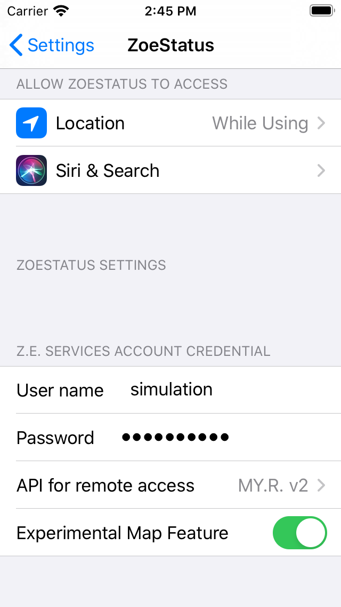

# ZoeStatus

This app is a replacement for the "official" Renault *Z.E Services* app on the iOS AppStore. 
However, it currently only covers a small part of its functionality:

- Battery state of charge (% and km)
- Charger state (e.g. speed)
- A/C preconditioning trigger and result of last command (experimental)

The goal is not really to eventually cover everything but to provide easier access to the most useful features in comparison to the official app.

It is based on the reverse engineered API documented here by Terence Eden: https://github.com/edent/Renault-Zoe-API

As long as there is no official API documentation, this app can never have more features than the offical website or app. It only attempts to make them a little more usable. For example, the current version of the offical app is asking for the credentials on almost every launch, which is rather annoying. With ZoeStatus, you only have to enter them once.

## Prerequisites:

- Renault "Zero Emission" vehicle, e.g. Renault ZOE
- Active "Renault ZE services" account (https://www.services.renault-ze.com)

## Compilation / Installation:

Use Xcode 10.1 or later to open and finally compile and install "ZoeStatus.xcodeproj" on your iOS device.

## Usage:
At the first launch it should take you to the settings app, where you need to enter your Z.E. service credentials. 

They are only used to login into those services. Please check the source code files to verify that they are not transmitted anywhere else. This is why the source is published here. Another reason is that I doubt that I can successfully publish this app on the AppStore without providing the review team with credentials for testing (which, rather obviously, I cannot).

The user interface is rather primitive and currently all icon based because doing so saves me from providing a dozen translations:

The meaning of the symbols in order of appearance (left-to-right and top-down) is as follows:

- battery state of charge in percent
- estimated remaining range in km
- date and time of this last retrieved status
- charger capability (slow or accelerated)
- charging (yes or no)
- estimated remaining time for charging
- plugged into charger (yes or no)
- A/C preconditioning command successful (yes or no)
- date and time of A/C preconditioning command
- button for sending "A/C precondition now", will turn into a countdown if successful
- Button for refreshing all of the above

## Disclaimer:

Neither me nor this work is in any way linked to Renault.
I may not be held responsible for any damage to your car or inconveniences that you may run into because of potentially incorrect display of the charge state by this app.
**Use at your own risk!**
